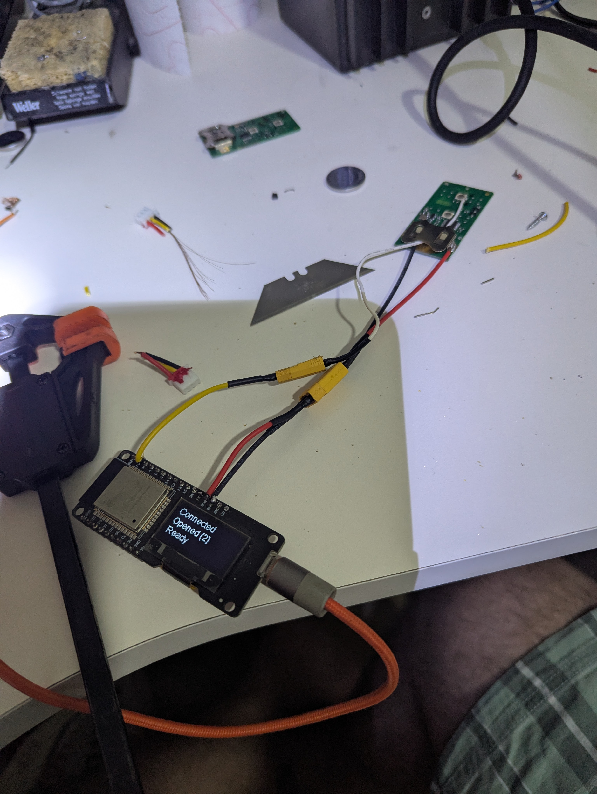
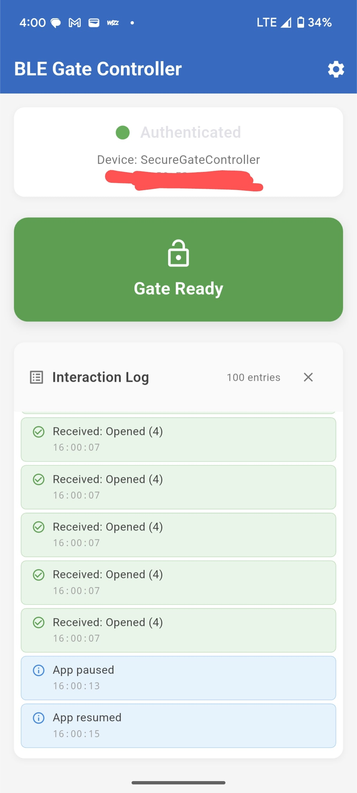
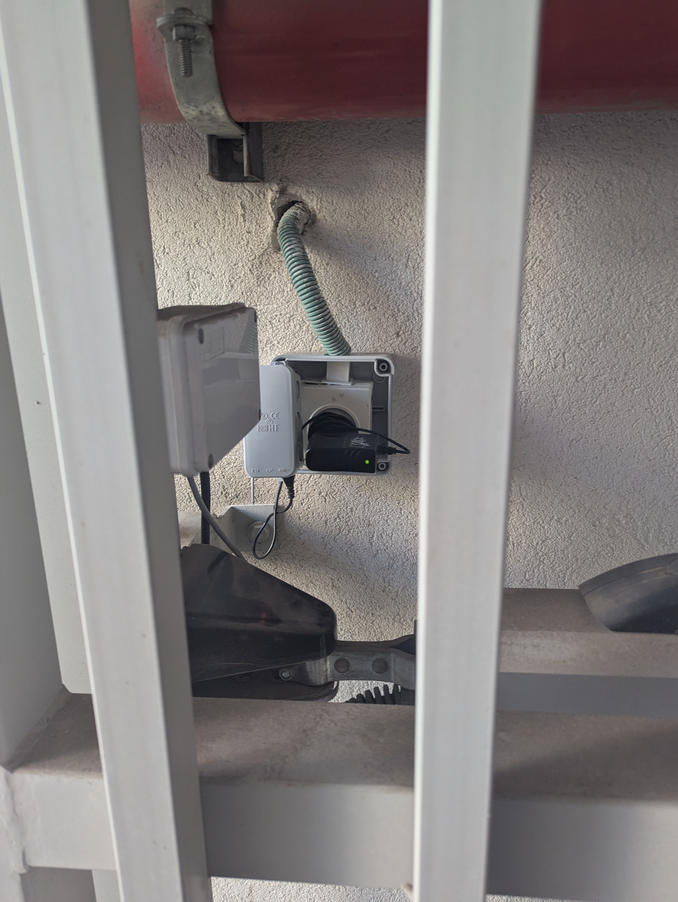

# 🚪 BLEGate: Bluetooth-Triggered RF Gate Opener

BLEGate is a DIY proof-of-concept project that enables **tap-to-open** control of RF gate systems using a **Flutter mobile app** and an **ESP32 microcontroller** via BLE communication. This is designed for gates that use **rolling-code remotes**, which typically block cloning or replay attempts.

Instead of reverse engineering the RF protocol, BLEGate interfaces **directly with the original remote hardware** — physically pressing the button with GPIO on command — creating a secure, simple, and practical solution.

---

## 📸 Demo


---

## 🧩 Project Components

### 1. ESP32 BLE Server

- Functions as a **Bluetooth Low Energy (BLE) GATT server**
- Waits for connection from a paired mobile device
- Upon connection, the client writes a **secret key** to a custom **UUID characteristic**
- Server verifies the key and triggers the GPIO pulse
- GPIO simulates a **button press** on the original gate remote
- Powered directly via AC from the gate's original remote board

> 💸 **ESP32 board cost:** ~3 USD

### 2. Flutter Mobile App

- Acts as a **BLE client**
- Connects to the ESP32 server and authenticates by writing a secret
- Minimal, responsive UI for one-tap control
- Designed for fast access and usability

---

## 🧠 Why Not Clone the Remote?

The gate system uses a **rolling key RF remote** protocol (e.g., KeeLoq), which:

- Cannot be cloned or replayed due to cryptographic rolling codes
- Locks out remotes if cloning is detected (confirmed during testing)
- Presents a high barrier for legitimate automation

> ❌ Attempting to clone the signal led to a **blacklisted remote** during early tests.

### ✅ The Better Solution:

Use the **original remote itself**, with soldered GPIO lines to simulate a button press.  
This avoids all cryptographic restrictions and remains within the designed operation of the gate.

---

## 🛠️ Hardware Setup



- ESP32 connects to the gate’s original RF remote through GPIO
- GPIO triggers simulate a button press
- Remote is powered through **AC**, which also powers the ESP32
- No batteries involved – plug-and-play with the gate’s outlet

---

## 📱 App UI



- Tap-to-open interface
- Shows connection status
- Can be extended for multiple gates or users

---

## 🚀 Final Deployment



- Remote + ESP32 mounted in weather-safe box
- Connected directly to AC outlet near the gate
- In use daily without interference to other remotes

---

## 🔐 Communication Flow

```mermaid
flowchart TD
  A[Phone BLE App] -->|Connect| B[ESP32 BLE Server]
  A -->|Write secret key to UUID| B
  B -->|Verify Key| B
  B -->|GPIO Trigger| C[Soldered Remote Button]
  C -->|RF Signal| D[Gate Receiver]
